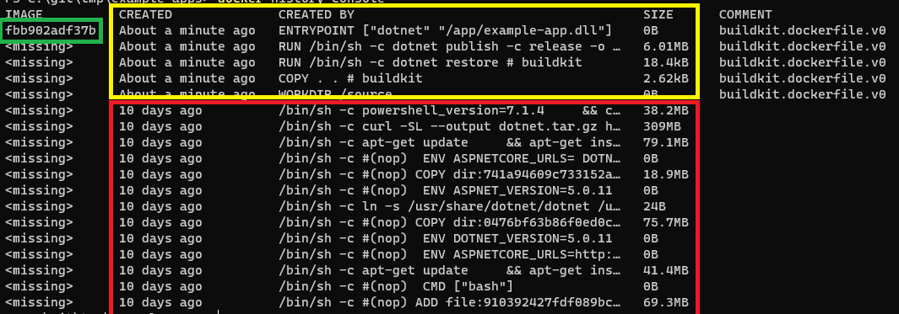
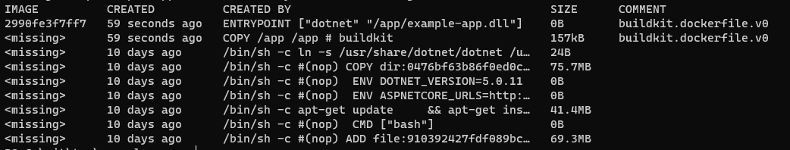
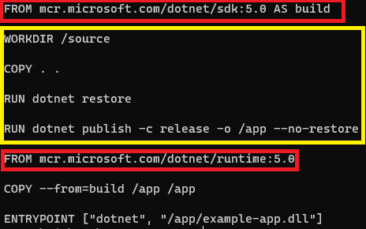
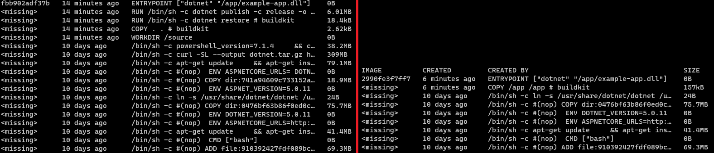

# Hands-On 1.1

## Passo 1

Começaremos clonando um repositório do github.com com uma aplicação de exemplo. Para isto, use o comando "git clone"!

```shell
$ git clone https://github.com/Jarzamendia/example-apps.git

$ cd example-apps

```

## Passo 2

Confirme que você está no diretório example-apps! Agora vamos ver o que o Dockerfile desta pequena aplicação irá fazer:

```shell
$ cat ./console/Dockerfile
```

Observe que ela usa a imagem "mcr.microsoft.com/dotnet/sdk:5.0" como base para buildar a aplicação.

## Passo 3

Certo, vamos criar nossa Imagem Docker.

```shell
$ docker build --tag console --file ./console/Dockerfile --progress tty ./console/
```

Com o fim da execução do comando, você pode usar o comando "docker image ls" para listar as imagens construidas.

```shell
$ docker image ls
```

## Passo 4

Podemos executar de outras maneiras este comando:

### Modo antigo

```shell
$ docker build --tag console --file ./console/Dockerfile --progress plain ./console/
```

### Modo do Dia a Dia

```shell
$ docker build -t console -f ./console/Dockerfile ./console/
```

### Modo SuperSimples!

```shell
$ cd console
$ docker build -t console .
```

## Passo 5

Agora vamos a uma rápida analise da nossa imagem.


```shell
$ docker history console
```



Observe a montagem de camadas, o tamanho de cada camada e por fim, o Image ID.

## Passo 6

Vamos agora criar uma Docker Image mais otimizada!

```shell
$ docker build --tag console-multistage --file ./console/Dockerfile-multistage --progress tty ./console/
```

Finalizado o build, verifique as novas imagens criadas:

```shell
$ docker images ls
```




### O que aconteceu?

```shell
$ cat ./console/Dockerfile-multistage
```


O Docker uso o MultiStage para descartar layers desnecessarias para a imagem final. 

Todas as camadas responsaveis pela build da aplicação foram descartadas no final. Apenas a pasta com a imagem foi copiada para a layer final.

```shell
$ docker history console-multistage
```



## Passo 7

```shell
$ docker login
```
ou

```shell
$ docker login https://index.docker.io/v1 --username xxx --password xxx
```

## Passo 8

```shell
$ docker run -it console-multistage
```

## Comandos uteis

```shell
$ docker run -d console-multistage
```

```shell
$ docker ps
```

```shell
$ docker logs -f <CONTAINER ID>
```

```shell
$ docker exec -it <CONTAINER ID> bash
```

```shell
$ docker stop <CONTAINER ID>
```

# O que fizemos até aqui?

 - Clonamos um repositório público do github.com.
 - Criamos uma Imagem Docker com uma aplicação em .Net Core.
 - Criamos uma Dockerfile com MultiStage pare economizar espaço em disco.
 - Fizemos login em um Docker Registry.
 - Subimos a imagem no DockerHub.
 - Executamos esta imagem.